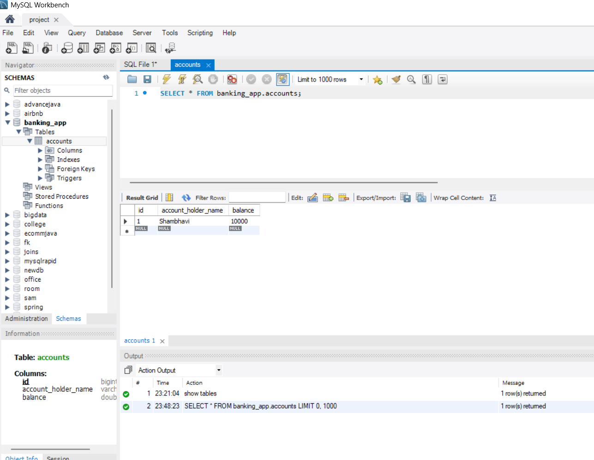

#  Banking Application

A RESTful Banking Application built using **Spring Boot**, **Spring Data JPA**, and **MySQL**. It provides APIs for managing bank accounts, including account creation, deposits, withdrawals, and balance retrieval.

##  Features

- Create Bank Account
- Deposit Money
- Withdraw Money
- Get Account Details
- Update Account Information
- Delete Account
- REST APIs
- Exception Handling

##  Tech Stack

- Java 21
- Spring Boot
- Spring Data JPA
- MySQL
- Maven
- IntelliJ IDEA
- Git & GitHub

##  Project Structure

```
src
 ├── controller
 ├── dto
 ├── entity
 ├── mapper
 ├── repository
 ├── service
 └── exception
```

##  Installation

```bash
git clone https://github.com/Shambhavisharma13/Banking-App.git
```

Open in IntelliJ and run:

```
BankingApplication.java
```

##  API Endpoints

| Method | Endpoint | Description |
|---------|----------|-------------|
| POST | /api/accounts | Create Account |
| GET | /api/accounts/{id} | Get Account |
| PUT | /api/accounts/{id}/deposit | Deposit |
| PUT | /api/accounts/{id}/withdraw | Withdraw |
| DELETE | /api/accounts/{id} | Delete Account |


#  Screenshots

## Database Table



---

##  POST API


---

##  GET API


## 🔄 PUT API


## 📸 Screenshots

### 🔹 Get All Accounts


### 🔹 Delete Account


### 🔹 MySQL Database


---

## 👩‍💻 Author

**Shambhavi Sharma**

- GitHub: https://github.com/Shambhavisharma13
- LinkedIn: *(Add your LinkedIn profile link here)*

**Shambhavi Sharma**

GitHub: https://github.com/Shambhavisharma13
